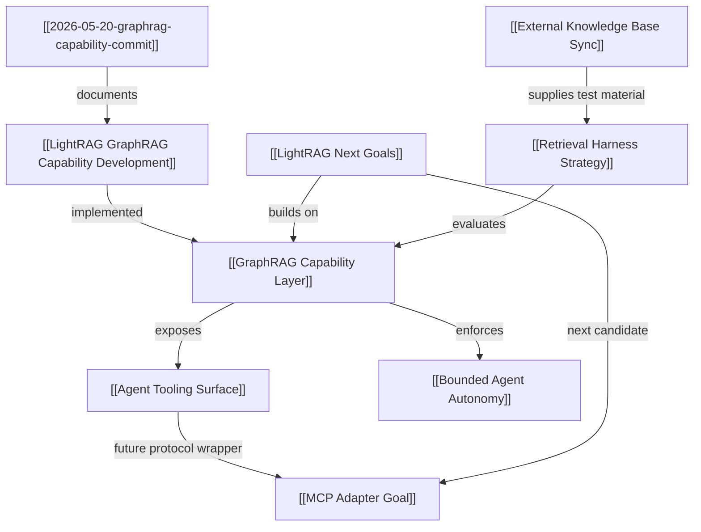

# LightRAG GraphRAG Capability Knowledge Graph

## Graph View

## Relationship Triples

- [[2026-05-20-graphrag-capability-commit]] -> documents -> [[LightRAG GraphRAG Capability Development]] ^[extracted]
- [[LightRAG GraphRAG Capability Development]] -> implemented -> [[GraphRAG Capability Layer]] ^[extracted]
- [[GraphRAG Capability Layer]] -> exposes -> [[Agent Tooling Surface]] ^[extracted]
- [[GraphRAG Capability Layer]] -> enforces -> [[Bounded Agent Autonomy]] ^[extracted]
- [[Agent Tooling Surface]] -> can be wrapped by -> [[MCP Adapter Goal]] ^[inferred]
- [[LightRAG Next Goals]] -> likely next step -> [[MCP Adapter Goal]] ^[inferred]
- [[Retrieval Harness Strategy]] -> evaluates -> [[GraphRAG Capability Layer]] ^[inferred]
- [[External Knowledge Base Sync]] -> supplies test material -> [[Retrieval Harness Strategy]] ^[inferred]

## Sources

- [[2026-05-20-graphrag-capability-commit]]

## Related Notes

- [[index|LightRAG LLM Wiki Index]]
- [[LightRAG Capability Navigation]]
- [[LightRAG Project Navigation]]
- [[GraphRAG Capability Layer]]
- [[Agent Tooling Surface]]
- [[Bounded Agent Autonomy]]
- [[MCP Adapter Goal]]
- [[Retrieval Harness Strategy]]
- [[External Knowledge Base Sync]]
